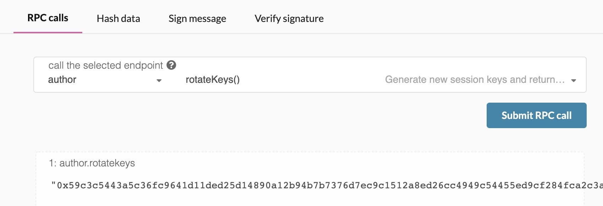
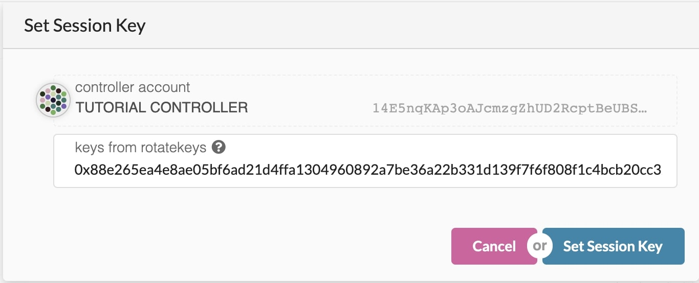
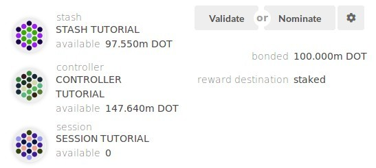

# How to validate on Kusama

**This guide works with the Kusama network.**

Before setting up the validator, you will most likely want to take a look at the [Secure Validator Setup Page](./secure-validator-setup.md) to make sure you know what factors you should consider when designing your validator architecture.

> You should **NOT** run a validator if you do not have enough technical knowledge to set up a validator. Any KSM that you stake for your validator is liable to be slashed, meaning that an insecure or improper setup may result in loss of KSM tokens! If you are not confident in your ability to run a validator node, it is recommended to nominate your KSM to a trusted validator node, instead.

If you need help, reach out on the [Kusama forum](https://forum.kusama.network/) or in the [Kusama Validator chat](https://riot.im/app/#/room/#KusamaValidatorLounge:polkadot.builders).

For this tutorial, we will use Ubuntu 18.04. No matter which operating system you are using, setup should be very similar. There are many [VPS](#vps-list) choices out there; feel free to pick the one you like.

## Install Rust

**Note:** Instead of installing Rust and building the Polkadot binary locally, you can [use Docker](#using-docker) if you already have it installed. 

If you have never installed Rust, you should do this first. This command will fetch the latest version of Rust and install it.

```bash
curl https://sh.rustup.rs -sSf | sh
```

Otherwise, if you have already installed Rust, run the following command to make sure you are using the latest version.

```bash
rustup update
```

 Finally, run this command to install the necessary dependencies for compiling and running the Kusama node software.

```
sudo apt install make clang pkg-config libssl-dev build-essential
```

Note - if you are using OS X, if you have [Homebrew](https://brew.sh) installed, you can issue the following equivalent command INSTEAD of the previous one:

```
brew install cmake pkg-config openssl git llvm
```

## Building and Installing Your `Kusama` Node

You will need to build your `kusama` from the `polkadot` source code.

> **WARNING:** The instructions below will currently build from the `master` branch of the repository. The official Kusama build will be tagged, and this guide updated, before genesis. You are welcome to try building now, but you will not get the official version of the validator software. This means you may not be able to connect to the `Kusama` network or experience other (more serious and harder to debug) issues!

```bash
git clone https://github.com/paritytech/polkadot.git
cd polkadot
cargo clean
./scripts/init.sh
cargo install --path ./ --force
```

Note: If you prefer to use SSH rather than HTTPS, you can replace the first line of the above with `git clone git@github.com:paritytech/polkadot.git`.

This step will take a while (generally 15 - 30 minutes, depending on your hardware).

If you are interested in generating keys locally, you can also install `subkey` from the same directory. You may then take the generated `subkey` executable and transfer it to an air-gapped machine for extra security.

```bash
cargo install --force --git https://github.com/paritytech/substrate subkey
```

## Synchronize Chain Data

After installing all related dependencies, you can start your Kusama node. Start to synchronize the chain by executing the following command:

```bash
polkadot
```

Depending on the size of the chain when you do this, this step may take anywhere from a few minutes to a few hours.

If you are interested in determining how much longer you have to go, your server logs (printed to STDOUT from the `polkadot` process) will tell you the latest block your node has processed and verified. You can then compare that to the current highest block via [Telemetry](https://telemetry.polkadot.io/#/Alexander) or the [PolkadotJS Block Explorer](https://polkadot.js.org/apps/#/explorer).

> **Note:** If you do not already have KSM, this is as far as you will be able to go until the end of the soft launch period. You can still run a node, but you will need to have a minimal amount of KSM to continue, as balance transfers are disabled during the soft launch. Please keep in mind that even for those with KSM, they will only be indicating their _intent_ to validate; they will also not be able to run a validator until the NPoS phase starts.

## Bond KSM

**Note:** For the soft launch period you must make your Controller and Stash accounts the same accounts. 

It is now time to set up our validator. We will do the following:

- Bond the KSM of the Stash account. These KSM will be put at stake for the security of the network and can be slashed.
- Select the Controller. This is the account that will decide when to start or stop validating.

First, go to the [Staking](https://polkadot.js.org/apps/#/staking/actions) section. Click on "Account Actions", and then the "New stake" button.


- **Stash account** - Select your Stash account. In this example, we will bond 100 milliKSMs - make sure that your Stash account contains _at least_ this much. You can, of course, stake more than this.
- **Controller account** - Select the Controller account created earlier. This account will also need a small amount of KSM in order to start and stop validating.
- **Value bonded** - How much KSM from the Stash account you want to bond/stake. Note that you do not need to bond all of the KSM in that account. Also note that you can always bond _more_ KSM later. However, _withdrawing_ any bonded amount requires the bonding duration period to be over.
- **Payment destination** - The account where the rewards from validating are sent. More info [here](https://wiki.polkadot.network/en/latest/polkadot/learn/staking/#reward-distribution).

Once everything is filled in properly, click `Bond` and sign the transaction (with your Stash account).

After a few seconds, you should see an "ExtrinsicSuccess" message. You should now see a new card with all your accounts (note: you may need to refresh the screen). The bonded amount on the right corresponds to the funds bonded by the Stash account.

## Set the Session Key

Once your node is fully synced, stop it using Control-C. At your terminal prompt, you will now start your node in validator mode.

```bash
polkadot --validator --name "name on telemetry"
```

> NOTE: Kusama has launched! It is now the default option when you start running `polkadot`.

You can give your validator any name that you like, but note that others will be able to see it, and it will be included in the list of all servers using the same telemetry server. Since numerous people are using telemetry, it is recommended that you choose something likely to be unique.

You will generate your [Session keys](https://wiki.polkadot.network/en/latest/polkadot/learn/keys/#session-key) in the client via RPC. You can do this through Polkadot JS connected to your local node (Toolbox > RPC Calls > author > rotateKeys()).  If you are doing this, make sure that you have your Polkadot explorer attached to your validator (in Settings).



or via CLI:

```bash
curl -H "Content-Type: application/json" -d '{"id":1, "jsonrpc":"2.0", "method": "author_rotateKeys", "params":[]}' http://localhost:9933
```

The output will have a hex-encoded "result" field. This is an encoding of your four Session keys.

You need to tell the chain your Session keys by signing and submitting an extrinsic. This is what associates your validator with your Controller account.

Go to [Staking > Account Actions](https://polkadot.js.org/apps/#/staking/actions), and click "Set Session Key" on the bonding account you generated earlier. Enter the output from `author_rotateKeys` in the field and click "Set Session Key".




Submit this extrinsic and you are now ready to start validating.

## Validate

To verify that your node is live and synchronized, head to [Telemetry](https://telemetry.polkadot.io/#/Kusama) and find your node. Note that this will show all nodes on the Kusama network, which is why it is important to select a unique name!

If everything looks good, go ahead and click on "Validate" in Polkadot UI.




- **Payment preferences** - Rewards you will keep, the rest will be shared among you and your nominators.

Click "Validate".

If you go to the Staking tab, you should see a list of active validators currently running on the network, as well as any nodes that have signaled their intention to be validators but have not yet been selected as being part of the current validator set. At the top of the page, it shows how many validator slots are available and how many nodes are intended to be a validator.


Your node will be shown in the *next up* queue. During [soft launch](#soft-launch) period there will be no era changes, your node will remain in the queue until the transition to the Proof-of-Stake validator selection. 

**After soft launch:** The validator set is refreshed every era. In the next era, if there is a slot available and your node is selected to join the validator set, your node will become an active validator. Until then, it will remain the _next up_ queue. If your validator is not selected to become part of the validator set, it will remain in the _next up_ queue until it is. There is no need to re-start if you are not selected for the validator set in a particular era. However, it may be necessary to increase the number of KSMs staked or seek out nominators for your validator in order to join the validator set.

## Soft Launch

When Kusama launches, it will be a Proof-of-Authority network, with nodes run by the Web3 Foundation. After having a sufficient _next up_ queue (50-100 validators), the network will upgrade to NPoS and allow validators into the validator set based on their stake.

**Congratulations!** If you have followed all of these steps, and been selected to be a part of the validator set, you are now running a Kusama validator! If you need help, reach out on the [Kusama forum](https://forum.kusama.network/) or in the [Kusama Validator chat](https://riot.im/app/#/room/#KusamaValidatorLounge:polkadot.builders).

## VPS List

* [OVH](https://www.ovh.com.au/)
* [Digital Ocean](https://www.digitalocean.com/)
* [Vultr](https://www.vultr.com/)
* [Linode](https://www.linode.com/)
* [Contabo](https://contabo.com/)
* [Scaleway](https://www.scaleway.com/)

## Using Docker

If you have Docker installed, you can use it to start your validator node without needing to build the binary. You can do this with a simple one line command:

```sh
$ docker run parity/polkadot:v0.5.0 --validator --name "name on telemetry"
```
